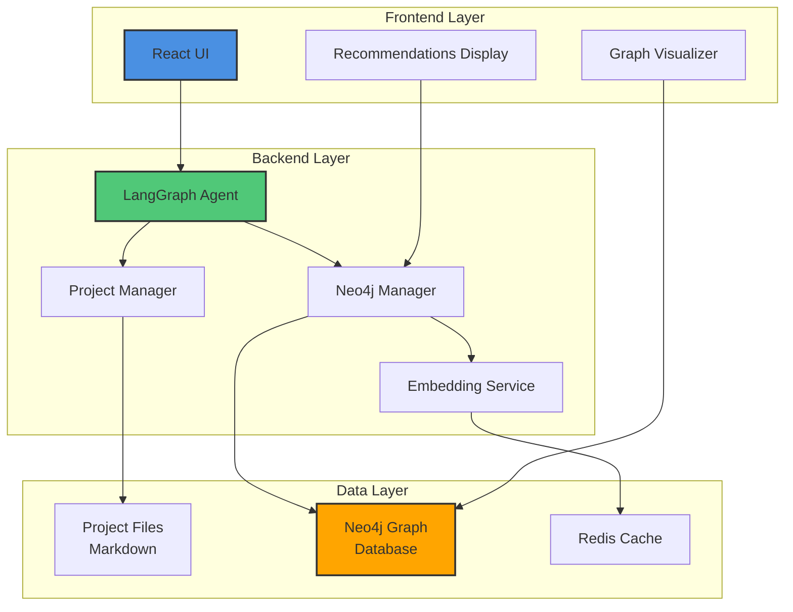
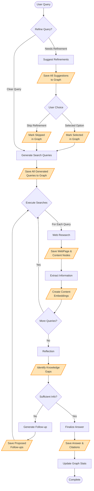
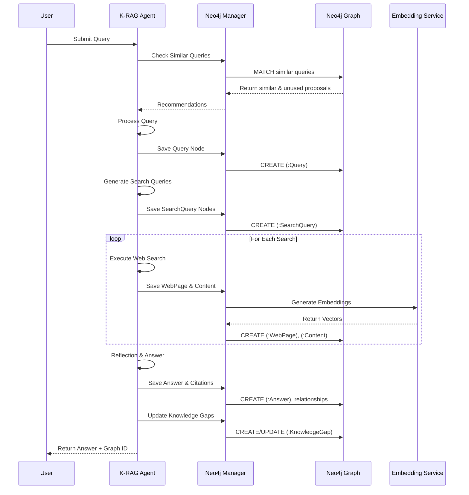
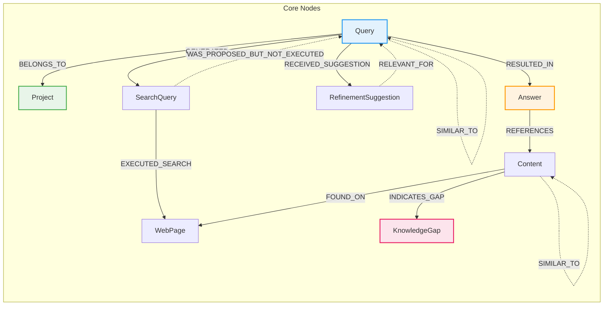
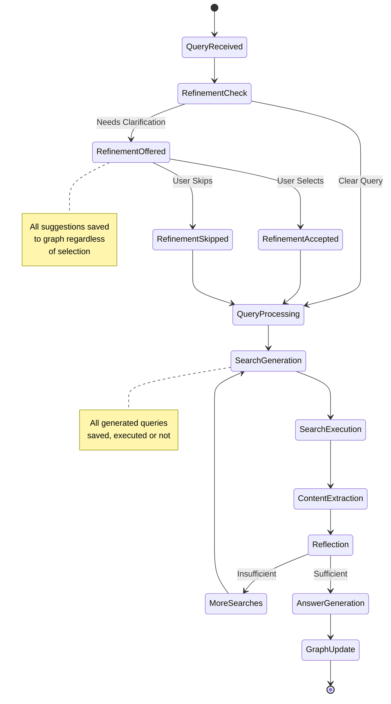
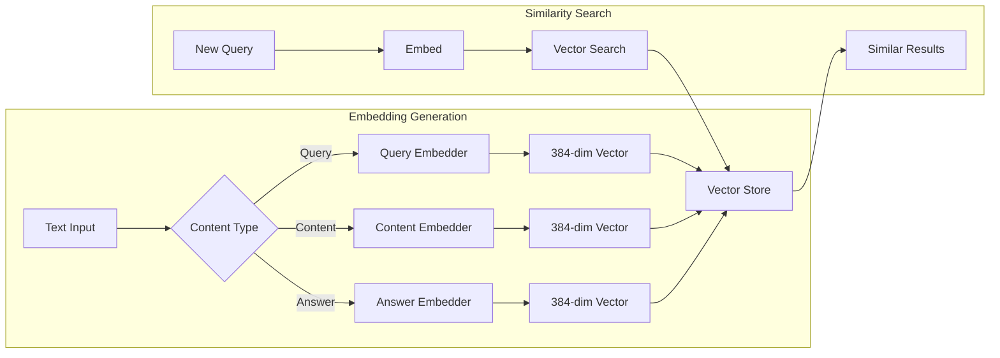
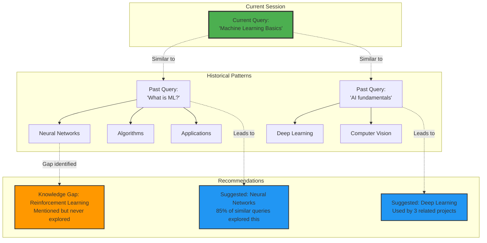
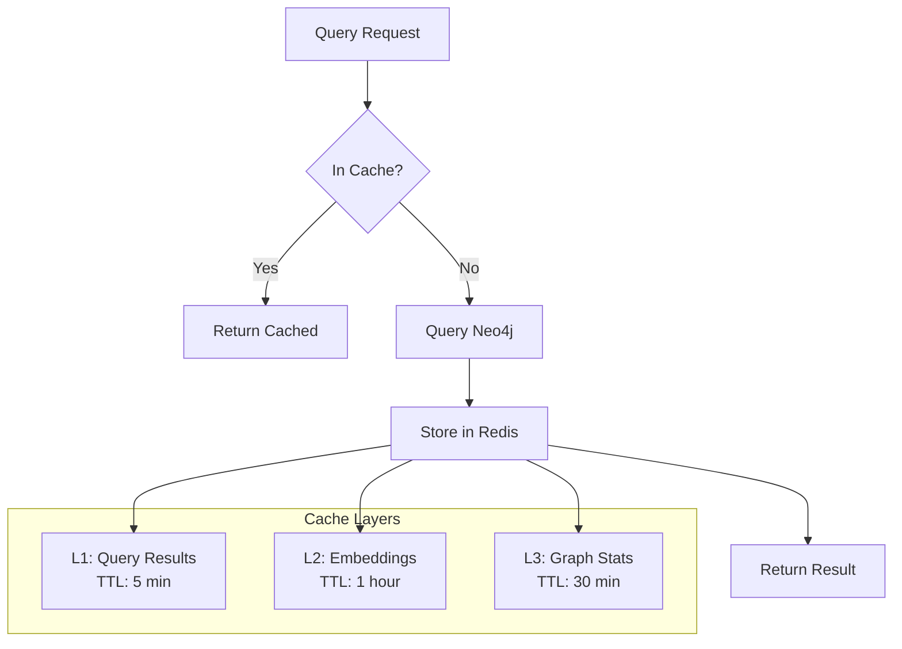
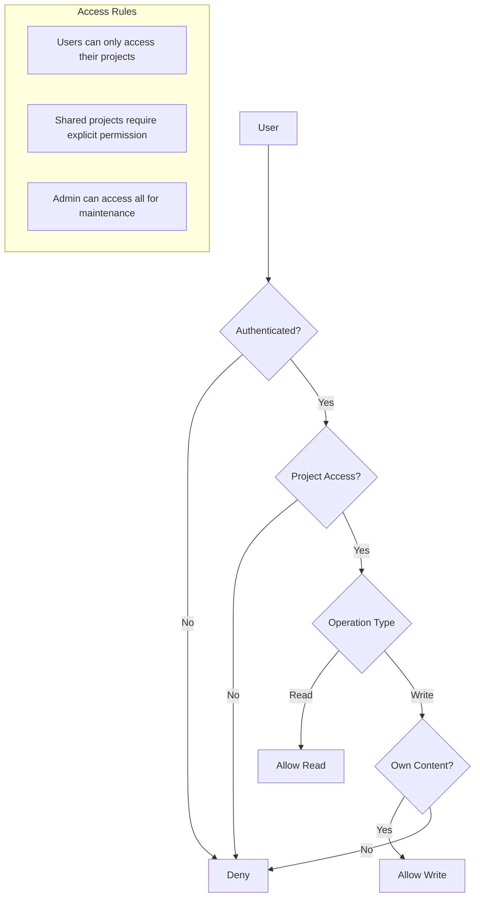
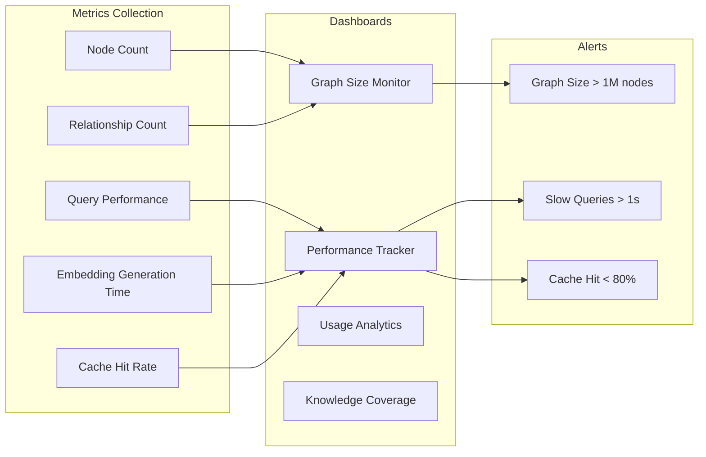

# Neo4j Knowledge Graph Integration for K-RAG Agent

## Neo4j Desktop 2025.05.0 Compatibility

This implementation is designed to be compatible with Neo4j Desktop 2025.05.0 and Neo4j 2025.x releases, incorporating:
- **Calendar Versioning (CalVer)**: Supporting Neo4j's new YYYY.MM.Patch format (e.g., 2025.01.0)
- **Java 21 Runtime**: Required for Neo4j 2025.01 and later
- **Block Format Storage**: Default for Enterprise Edition, supporting enhanced performance
- **Vector Indexes**: Optimized memory configuration for embedding-based similarity search
- **Cypher 25 API**: Ready for the upcoming Cypher API versioning

## Implementation Status

✅ **Completed Components:**
- Docker Compose configuration with Neo4j 2025-compatible settings
- Neo4j Manager module with full CRUD operations
- Integration into agent workflow (all nodes updated)
- API endpoints for graph visualization and queries
- Migration script for existing markdown projects
- Environment configuration and initialization scripts
- Vector index support for semantic similarity search

📋 **Usage Guide:** See [NEO4J_INTEGRATION.md](NEO4J_INTEGRATION.md) for setup and usage instructions.

## Executive Summary

This document outlines the integration of Neo4j graph database with the K-RAG Agent to create a persistent, interconnected knowledge management system. **Important: The Neo4j integration is supplementary to the existing markdown-based storage system.** All current project management features remain unchanged, while Neo4j adds advanced intelligence capabilities on top of the existing functionality.

The system captures not only successful research paths but also unexplored options, creating a comprehensive knowledge graph that grows smarter with each use.

## Dual Storage Architecture

K-RAG Agent employs a dual storage approach:

1. **Primary Storage (Markdown)**: 
   - All projects, queries, and results are saved as markdown files
   - Located in the `/projects` directory
   - Human-readable format for easy access and version control
   - Remains the source of truth for all content

2. **Supplementary Storage (Neo4j)**:
   - Adds relationship tracking and graph intelligence
   - Enables cross-project insights and recommendations
   - Tracks unexplored paths and knowledge gaps
   - Optional and can be disabled without affecting core functionality

Both systems work in parallel, ensuring data redundancy and allowing users to benefit from graph intelligence while maintaining full control over their data in simple markdown format.

## Table of Contents

1. [System Architecture](#system-architecture)
2. [Agent Workflow Integration](#agent-workflow-integration)
3. [Graph Data Model](#graph-data-model)
4. [Implementation Details](#implementation-details)
5. [Advanced Features](#advanced-features)
6. [Performance Optimization](#performance-optimization)
7. [Security and Privacy](#security-and-privacy)

## System Architecture

### Overall Architecture Flow



## Agent Workflow Integration

### Complete Agent Flow with Graph Integration Points



### Data Flow from Query to Graph



## Graph Data Model

### Node and Relationship Schema



### Query Lifecycle State Machine



## Implementation Details

### 1. Infrastructure Components

#### Docker Compose Configuration

```yaml
version: '3.8'

services:
  neo4j:
    image: neo4j:2025-community  # Use Neo4j 2025 release
    container_name: krag-neo4j
    environment:
      # Authentication
      - NEO4J_AUTH=neo4j/${NEO4J_PASSWORD:-krag2024}
      
      # Plugins - Updated for 2025 compatibility
      - NEO4J_PLUGINS=["apoc", "graph-data-science"]
      
      # Memory Configuration - Optimized for Vector Indexes
      # Formula: Heap + PageCache + 0.25(VectorIndexSize) + OS Memory
      - NEO4J_server_memory_heap_initial__size=1G
      - NEO4J_server_memory_heap_max__size=2G
      - NEO4J_server_memory_pagecache__size=1G
      
      # Block Format Configuration (Default in 2025.01+)
      - NEO4J_db_format=block
      - NEO4J_db_block__format_version=2025
      
      # Java 21 Runtime (Required for Neo4j 2025.01+)
      - NEO4J_server_jvm_additional=-XX:+UseG1GC
      - NEO4J_server_jvm_additional=-XX:+ParallelRefProcEnabled
      - NEO4J_server_jvm_additional=-XX:+DisableExplicitGC
      
      # Vector Index Memory Optimization
      - NEO4J_db_index_fulltext_default__analyzer=standard-no-stop-words
      - NEO4J_server_memory_off__heap_max__size=512m
      
      # Security - SSL/TLS hostname verification (enabled by default in 2025.01)
      - NEO4J_dbms_ssl_policy_bolt_verify__hostname=true
      
    ports:
      - "7474:7474"  # HTTP
      - "7687:7687"  # Bolt
    volumes:
      - neo4j_data:/data
      - neo4j_logs:/logs
      - neo4j_import:/var/lib/neo4j/import
      - neo4j_plugins:/plugins
    networks:
      - krag-network

  redis:
    image: redis:7-alpine
    container_name: krag-redis
    ports:
      - "6379:6379"
    volumes:
      - redis_data:/data
    networks:
      - krag-network

volumes:
  neo4j_data:
  neo4j_logs:
  neo4j_import:
  neo4j_plugins:
  redis_data:

networks:
  krag-network:
    driver: bridge
```

### 2. Neo4j Manager Module Structure

```python
# backend/src/agent/neo4j_manager.py

from neo4j import AsyncGraphDatabase
from typing import List, Dict, Optional, Any
import asyncio
from datetime import datetime
import numpy as np
from sentence_transformers import SentenceTransformer

class Neo4jManager:
    def __init__(self, uri: str, user: str, password: str):
        self.driver = AsyncGraphDatabase.driver(uri, auth=(user, password))
        self.embedder = SentenceTransformer('all-MiniLM-L6-v2')
    
    async def create_indices(self):
        """Create necessary indices for performance"""
        queries = [
            "CREATE INDEX query_text IF NOT EXISTS FOR (q:Query) ON (q.text)",
            "CREATE INDEX webpage_url IF NOT EXISTS FOR (w:WebPage) ON (w.url)",
            "CREATE INDEX project_id IF NOT EXISTS FOR (p:Project) ON (p.id)",
            "CREATE VECTOR INDEX content_embedding IF NOT EXISTS FOR (c:Content) ON (c.embedding)"
        ]
        async with self.driver.session() as session:
            for query in queries:
                await session.run(query)
    
    async def save_query_session(self, session_data: Dict[str, Any]):
        """Save complete query session to graph"""
        async with self.driver.session() as session:
            # Transaction to ensure atomicity
            async with session.begin_transaction() as tx:
                # Create Query node
                query_result = await tx.run("""
                    CREATE (q:Query {
                        id: $id,
                        text: $text,
                        timestamp: datetime($timestamp),
                        project_id: $project_id,
                        session_id: $session_id,
                        was_refined: $was_refined
                    })
                    RETURN q
                """, session_data['query'])
                
                # Create SearchQuery nodes
                for sq in session_data['search_queries']:
                    await tx.run("""
                        MATCH (q:Query {id: $query_id})
                        CREATE (sq:SearchQuery {
                            id: $id,
                            query_text: $query_text,
                            rationale: $rationale,
                            was_executed: $was_executed,
                            timestamp: datetime()
                        })
                        CREATE (q)-[:GENERATED]->(sq)
                    """, query_id=session_data['query']['id'], **sq)
                
                # Commit transaction
                await tx.commit()
```

### 3. Integration Points in Agent Workflow

#### A. Refine Query Integration

```python
# In graph.py - refine_query function

async def refine_query(state: OverallState, config: RunnableConfig) -> RefinementState:
    # ... existing logic ...
    
    # Save all refinement suggestions to graph
    if suggestions:
        await neo4j_manager.save_refinement_suggestions(
            query_id=state.get("query_id"),
            suggestions=[{
                "text": s,
                "reasoning": "Generated based on ambiguity detection",
                "timestamp": datetime.now()
            } for s in suggestions],
            selected_index=state.get("selected_refinement_index", None)
        )
    
    return refinement_state
```

#### B. Search Query Tracking

```python
# In graph.py - generate_query function

async def generate_query(state: OverallState, config: RunnableConfig):
    # ... existing logic ...
    
    # Save all generated queries
    await neo4j_manager.save_search_queries(
        query_id=state.get("query_id"),
        search_queries=[{
            "query_text": sq.query,
            "rationale": sq.rationale,
            "execution_order": idx,
            "was_executed": idx < state.get("max_searches", 5)
        } for idx, sq in enumerate(result.query)]
    )
    
    return {"search_query": result.query}
```

### 4. Graph Queries for Intelligence

#### Finding Similar Past Queries

```cypher
// Find queries similar to the current one
MATCH (q:Query)
WHERE q.embedding IS NOT NULL
WITH q, gds.similarity.cosine(q.embedding, $current_embedding) AS similarity
WHERE similarity > 0.8
RETURN q.text, q.id, similarity
ORDER BY similarity DESC
LIMIT 10
```

#### Retrieving Unused Proposals

```cypher
// Get unused proposals relevant to current query
MATCH (q:Query)-[:GENERATED]->(sq:SearchQuery)
WHERE sq.was_executed = false
AND gds.similarity.cosine(sq.embedding, $current_embedding) > 0.7
RETURN sq.query_text, sq.rationale, q.timestamp
ORDER BY q.timestamp DESC
LIMIT 5
```

#### Knowledge Gap Analysis

```cypher
// Identify recurring knowledge gaps
MATCH (c:Content)-[:INDICATES_GAP]->(kg:KnowledgeGap)
WITH kg, COUNT(c) as mentions
WHERE mentions > 3
MATCH (kg)<-[:INDICATES_GAP]-(c:Content)<-[:FOUND_ON]-(w:WebPage)
RETURN kg.topic, mentions, COLLECT(DISTINCT w.domain) as sources
ORDER BY mentions DESC
```

## Advanced Features

### 1. Embedding Pipeline



### 2. Knowledge Gap Detection

```python
async def identify_knowledge_gaps(self, project_id: Optional[str] = None):
    """Identify topics that appear frequently but are never fully explored"""
    
    query = """
    MATCH (q:Query)-[:GENERATED]->(sq:SearchQuery)
    WHERE sq.was_executed = false
    WITH sq.query_text as unexplored_topic, COUNT(*) as frequency
    WHERE frequency > 2
    
    OPTIONAL MATCH (q2:Query)-[:GENERATED]->(sq2:SearchQuery)
    WHERE sq2.was_executed = true 
    AND sq2.query_text CONTAINS unexplored_topic
    
    WITH unexplored_topic, frequency, COUNT(sq2) as explored_count
    WHERE explored_count = 0
    
    CREATE (kg:KnowledgeGap {
        id: randomUUID(),
        topic: unexplored_topic,
        identified_at: datetime(),
        times_encountered: frequency,
        priority_score: frequency * 1.5
    })
    
    RETURN kg
    """
    
    async with self.driver.session() as session:
        result = await session.run(query, project_id=project_id)
        return [record["kg"] async for record in result]
```

### 3. Research Path Recommendations



## Performance Optimization

### 1. Indexing Strategy

```cypher
-- Neo4j 2025 Optimized Indexing Strategy

-- Text indices for exact matches (Block Format Optimized)
CREATE INDEX query_text_idx IF NOT EXISTS FOR (q:Query) ON (q.text);
CREATE INDEX content_text_idx IF NOT EXISTS FOR (c:Content) ON (c.text);
CREATE INDEX webpage_url_idx IF NOT EXISTS FOR (w:WebPage) ON (w.url);
CREATE INDEX project_id_idx IF NOT EXISTS FOR (p:Project) ON (p.id);

-- Composite indices for common queries
CREATE INDEX query_project_time IF NOT EXISTS FOR (q:Query) ON (q.project_id, q.timestamp);

-- Full-text search indices (Neo4j 2025 syntax)
CREATE FULLTEXT INDEX query_search IF NOT EXISTS FOR (q:Query) ON EACH [q.text];
CREATE FULLTEXT INDEX content_search IF NOT EXISTS FOR (c:Content) ON EACH [c.text, c.summary];

-- Vector indices for similarity search (Neo4j 2025 optimized)
CREATE VECTOR INDEX query_embedding_idx IF NOT EXISTS 
FOR (q:Query) ON (q.embedding) 
OPTIONS {indexConfig: {
  `vector.dimensions`: 384,
  `vector.similarity_function`: 'cosine',
  `vector.quantization.enabled`: true,
  `vector.quantization.type`: 'int8',
  `vector.hnsw.m`: 16,
  `vector.hnsw.ef_construction`: 200
}};

CREATE VECTOR INDEX content_embedding_idx IF NOT EXISTS 
FOR (c:Content) ON (c.embedding) 
OPTIONS {indexConfig: {
  `vector.dimensions`: 384,
  `vector.similarity_function`: 'cosine',
  `vector.quantization.enabled`: true,
  `vector.quantization.type`: 'int8',
  `vector.hnsw.m`: 16,
  `vector.hnsw.ef_construction`: 200
}};
```

### 2. Caching Strategy



## Security and Privacy

### 1. Access Control Model



### 2. Data Privacy Implementation

```python
# Privacy-aware node creation
async def create_content_node(self, content: str, source_url: str, 
                             is_sensitive: bool = False):
    """Create content node with privacy considerations"""
    
    # Check for sensitive patterns
    if is_sensitive or self._contains_sensitive_data(content):
        # Store only hash and metadata
        query = """
        CREATE (c:Content {
            id: randomUUID(),
            content_hash: $hash,
            is_sensitive: true,
            type: $type,
            source_url: $url,
            created_at: datetime()
        })
        """
        params = {
            "hash": hashlib.sha256(content.encode()).hexdigest(),
            "type": "sensitive",
            "url": source_url
        }
    else:
        # Store full content with embedding
        embedding = await self._generate_embedding(content)
        query = """
        CREATE (c:Content {
            id: randomUUID(),
            text: $text,
            embedding: $embedding,
            type: $type,
            source_url: $url,
            created_at: datetime()
        })
        """
        params = {
            "text": content,
            "embedding": embedding,
            "type": "normal",
            "url": source_url
        }
    
    async with self.driver.session() as session:
        await session.run(query, params)
```

## Neo4j 2025 Specific Features

### Calendar Versioning Benefits
- **Continuous Innovation**: Monthly production-ready releases with new features
- **Simplified Upgrades**: No more disruptive major version migrations
- **Predictable Release Cycle**: YYYY.MM.Patch format makes planning easier

### Block Format Advantages
- **Enhanced Performance**: 10x faster query performance with Parallel Runtime
- **Extended Limits**: Token names up to 16,383 characters (vs 63 in aligned format)
- **Better Compression**: Improved storage efficiency for large graphs
- **Differential Backups**: Faster and more efficient backup operations

### Vector Index Enhancements
The Neo4j 2025 release includes optimized vector indexes with:
- **Quantization Support**: Reduces memory usage by up to 75% with int8 quantization
- **HNSW Algorithm**: Hierarchical Navigable Small World for faster similarity search
- **Configurable Parameters**: Fine-tune M and ef_construction for your use case

### Java 21 Requirements
Neo4j 2025.01+ requires Java 21, bringing:
- **Better Performance**: Improved G1GC garbage collection
- **Virtual Threads**: Enhanced concurrency for better scalability
- **Pattern Matching**: Cleaner code with modern Java features

## Migration Strategy

### Migrating to Neo4j 2025

#### Pre-Migration Checklist
1. **Java Version**: Ensure Java 21 is installed
2. **Database Format**: Convert to block format if using aligned format
3. **Token Name Length**: Verify all token names are under 16,383 characters
4. **Discovery Service**: Migrate from v1 to v2 before upgrading

#### Migration Steps
```bash
# 1. Backup existing database
neo4j-admin database dump neo4j --to=/backup/neo4j-backup.dump

# 2. Stop current Neo4j instance
docker-compose down

# 3. Update docker-compose.yml to use neo4j:2025-community image

# 4. Start new instance
docker-compose up -d

# 5. Restore database (if needed)
neo4j-admin database load neo4j --from=/backup/neo4j-backup.dump
```

### Importing Existing Projects

```python
async def import_markdown_projects(self, projects_dir: Path):
    """Import existing markdown files into graph"""
    
    for project_dir in projects_dir.iterdir():
        if project_dir.is_dir():
            # Create project node
            project_id = project_dir.name.split('_')[-1]
            project_name = project_dir.name.rsplit('_', 1)[0]
            
            await self.create_project(project_id, project_name)
            
            # Import each session
            for md_file in project_dir.glob('*.md'):
                if md_file.name != 'index.md':
                    session_data = self._parse_markdown_session(md_file)
                    await self.import_session(project_id, session_data)
```

## Monitoring and Analytics

### Graph Health Dashboard



## Conclusion

The Neo4j integration transforms K-RAG from a session-based research tool into a comprehensive knowledge management system. By capturing all aspects of the research process - including unexplored paths and dismissed suggestions - the system builds a rich knowledge graph that becomes more valuable with each use.

Key benefits include:
- **Persistent Knowledge**: No research or suggestion is ever lost
- **Collective Intelligence**: Each session contributes to system-wide learning
- **Smart Recommendations**: Leverage past research for current queries
- **Knowledge Gap Discovery**: Identify areas needing exploration
- **Research Efficiency**: Avoid duplicating past work

The implementation provides a solid foundation for advanced features like collaborative research, knowledge trend analysis, and automated research planning based on identified gaps.